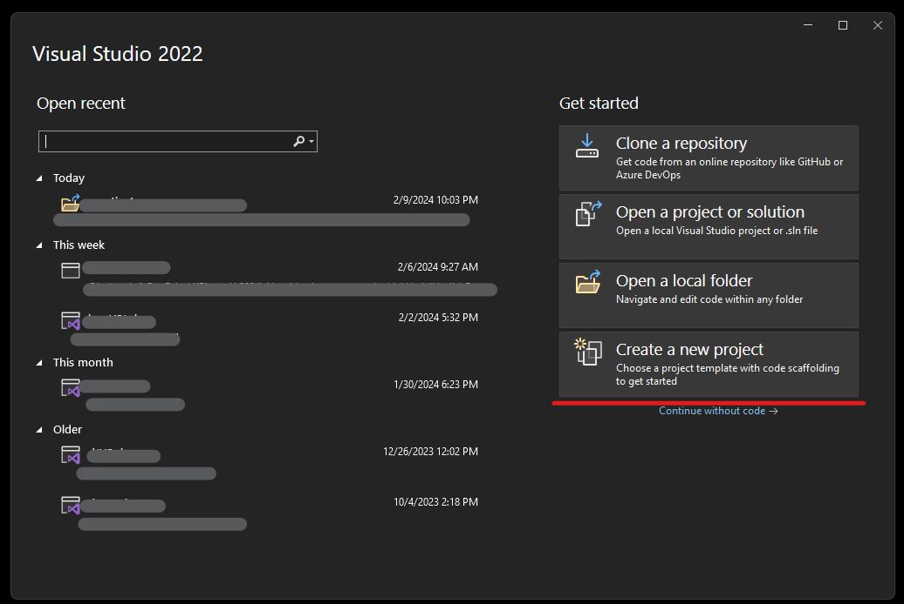
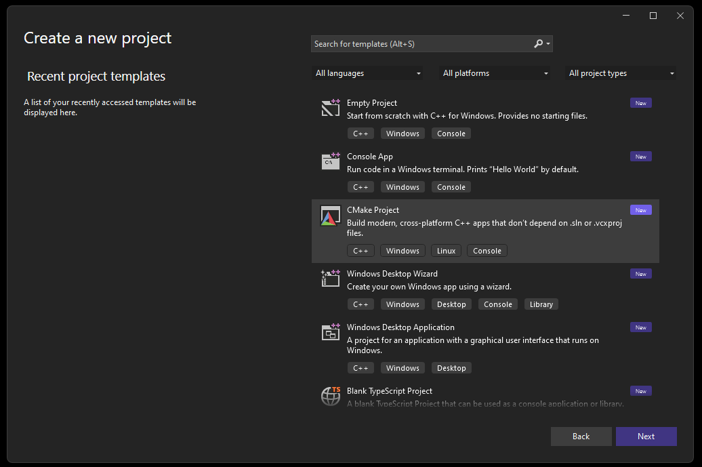
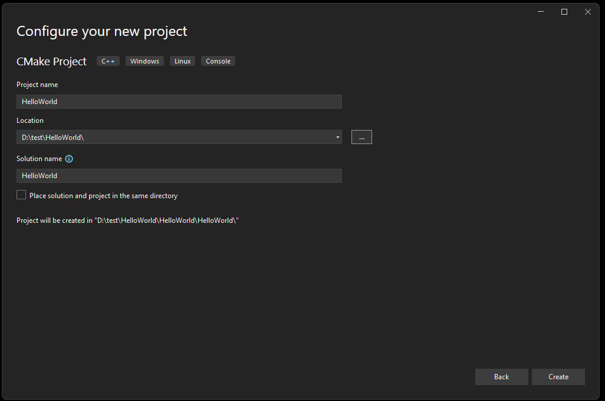
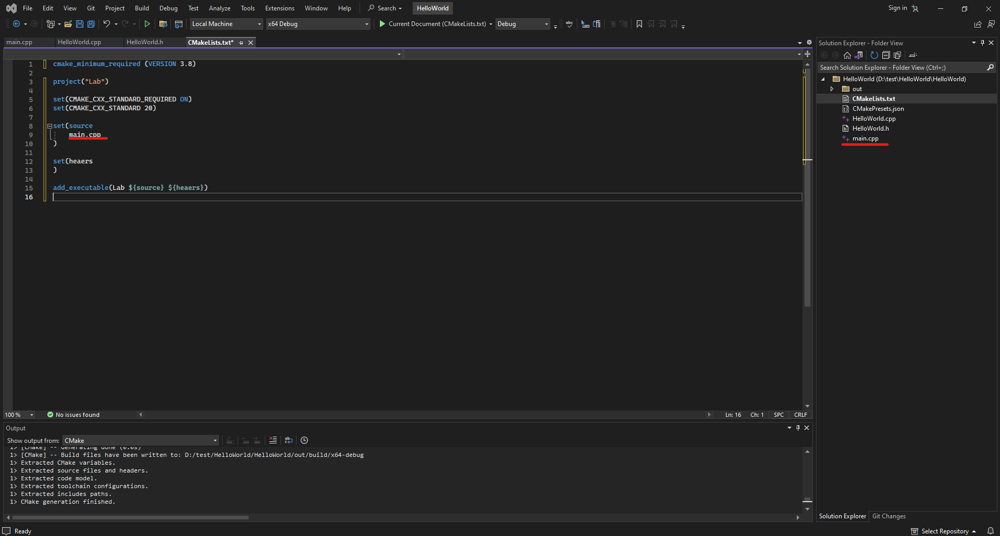
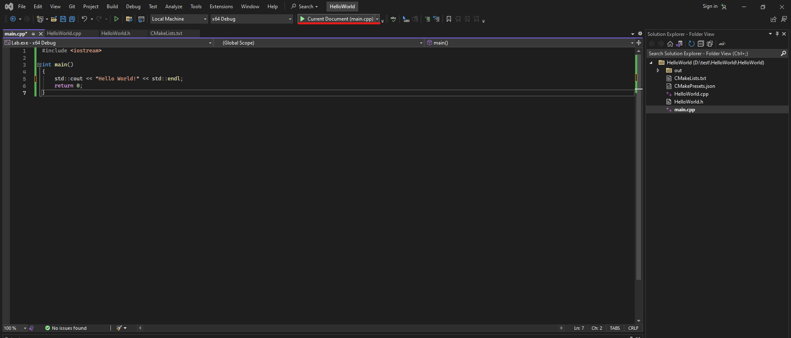

C++ build first app
===================

1) Go to VisualStudio

2) Create empty CMake project

3) Select name for it

4) We have the same typical project. But the CMakeLists file can be removed and a simpler script written. The code is in the block below.

.. code-block:: CMake

    cmake_minimum_required (VERSION 3.20)

    project("Lab")

    set(CMAKE_CXX_STANDARD_REQUIRED ON)
    set(CMAKE_CXX_STANDARD 20)

    set(source
        main.cpp
    )

    set(heaers
    )

    add_executable(Lab ${source} ${heaers})

5) Create "main.cpp" and open

6) Paste this code:

.. code-block:: c++

    #include <iostream>

    int main()
    {
        std::cout << "Hello World!" << std::endl;
        return 0;
    }

7) Press Run button is "VS"

