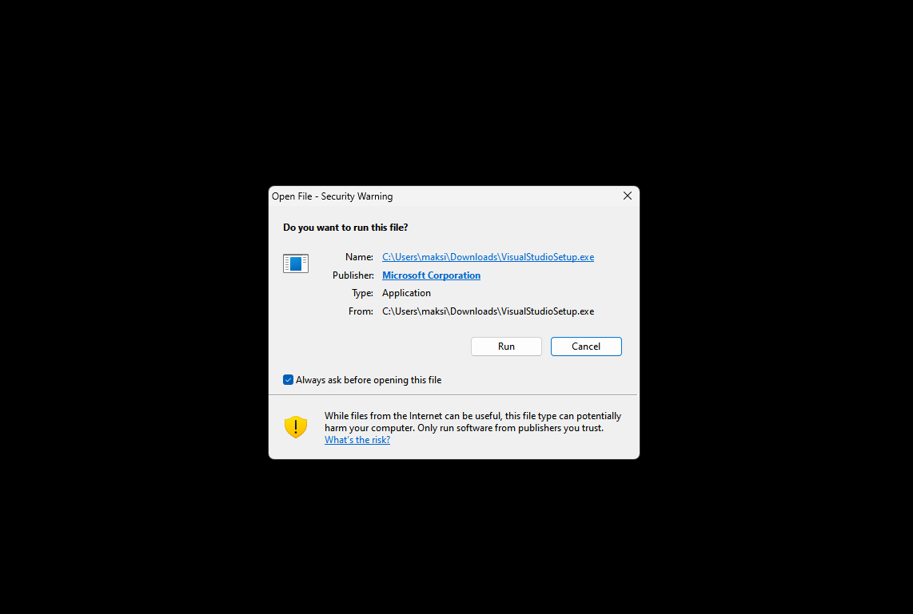
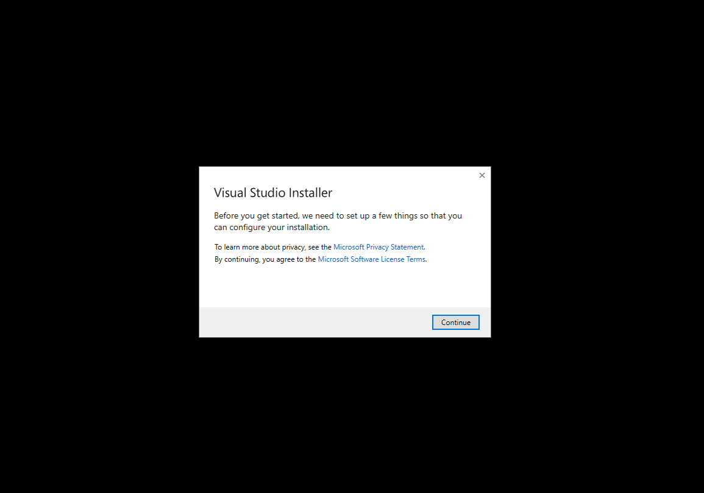
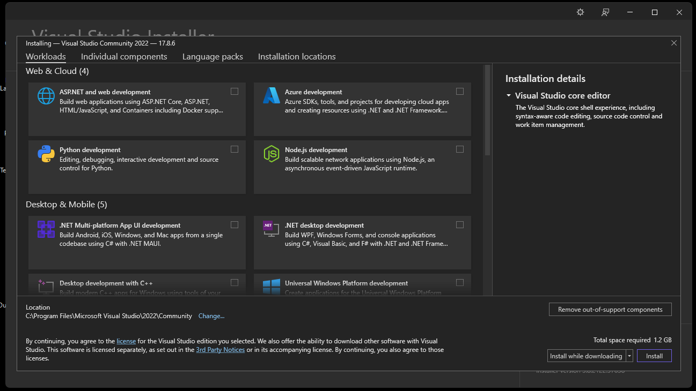
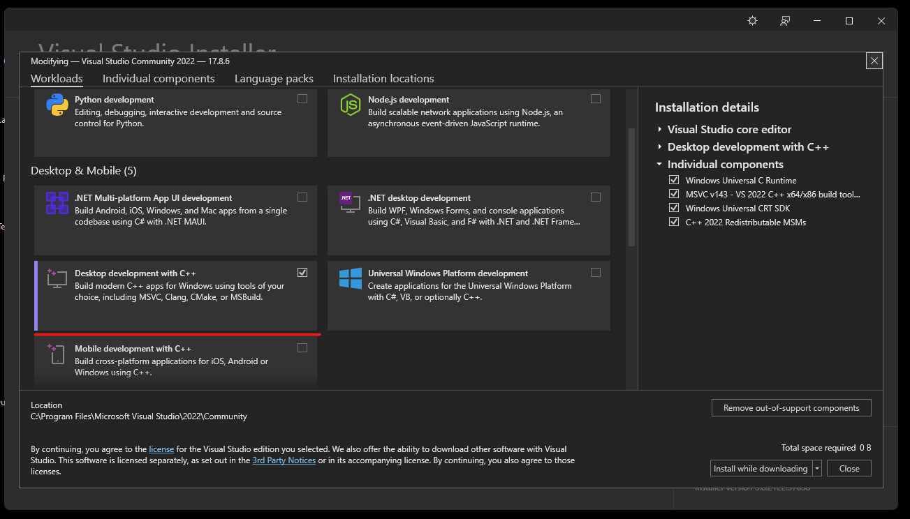

C++ compiler installation guide
===============================

`VisualStudio`_

VisualStudio
------------

1) Go to _site: https://visualstudio.microsoft.com/vs/community/ download *Visual Studio Community*

2) Open *VisualStudioSetup.exe*

3) Press "Run" button

4) Press "Continue" button

5) For simple installation C++ compiler, CMake, and Windows SDK need to select "Desktop development with C++"

6) Press install button

