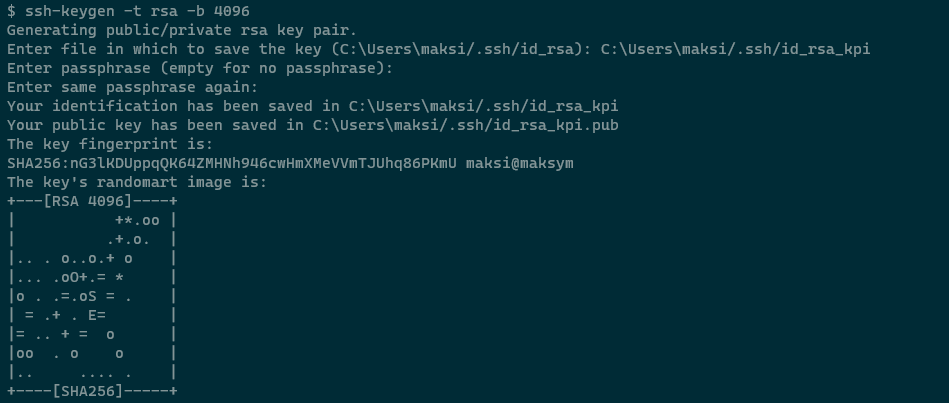
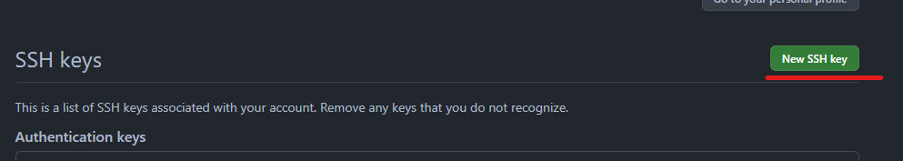
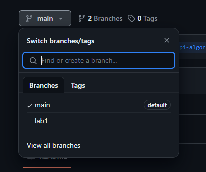

Git Guide
=========

`Install`_
`Add user config`_
`Create SSH key`_
`Clone repository`_
`Fork repository`_
`Create new branch`_
`Create commit`_

Install
-------

1) Go to _site: https://git-scm.com/

2) Press "Download" button

3) Select `Standalone Installer`. `64-bit Git for Windows Setup`

4) On the second install step select editor. Example `VS core`, or `VIM`

Add user config
---------------

1) Open terminal

2) Command :code:`git config --global user.name "<<name same with your account>>"`

3) Command :code:`git config --global user.email "<<name same with your account>>"`

Create SSH key
--------------

1) Open terminal

2) Command: :code:`ssh-keygen -t rsa -b 4096` - generate ssh key

this is key is deprecated. You can not try to use it.

3) Next, copy public RSA key :code:`clip < ~/.ssh/<<file name>>`. Example: :code:`clip < ~/.ssh/id_rsa_kpi.pub`. Command for mac: :code:`pbcopy < ~/.ssh/id_rsa_kpi.pub`, Command for linux: :code:`cat ~/.ssh/id_rsa_kpi.pub`

4) Go to github web.

5) Open Profile -> Settings

6) SSH and GPG keys

7) Press `New SSH Key`

8) Paste your key and save

Clone repository
----------------

1) Go to _repository: https://github.com/maksym-aldokhin/kpi-algorithmic-programming

2) Copy SSH of repository.

3) Go to console on computer.

4) Write: :code:`git clone <<ssh>>`

Fork repository
---------------

1) Go to _repository: https://github.com/maksym-aldokhin/kpi-algorithmic-programming

2) Press `Fork`

3) Create fork

3) You have forked repository

4) This is repository You mast clone on your computer `Clone repository`_

Create new branch
-----------------

1) Go to your repository folder in computer

2) Write command in the terminal: :code:`git checkout -b <<branch name>>`. Example: :code:`git checkout -b lab1`

3) After this, you have a new branch. But this branch does not exist on the server.

4) It is necessary for the branch to appear on the server: :code:`git push --set-upstream origin <<branch name>>`. Example: :code:`git push --set-upstream origin lab1`

5) After this branch is exist

Create commit
-------------

1) Open terminal

2) Changed your local files. For example, add a new file.

3) For check changes need write :code:`git status`

4) Next need add this is file :code:`git add "new file.txt"`

5) Next check status

6) Create commit: :code:`git commit`. You can add :code:`-m "commit message"` for an easier option.

7) :code:`git push`

