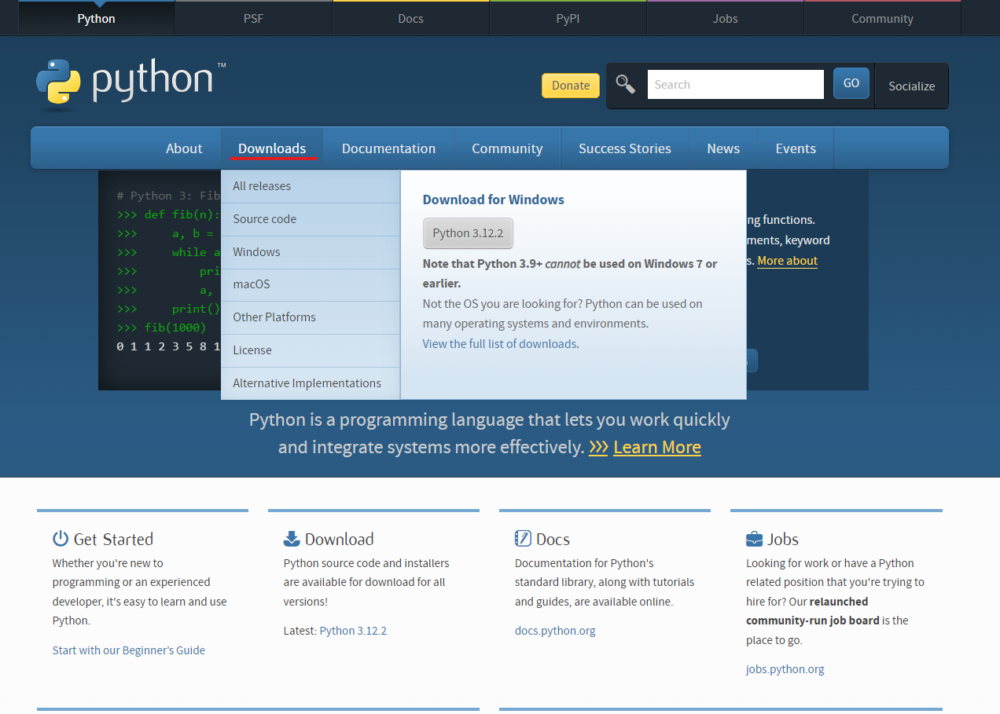
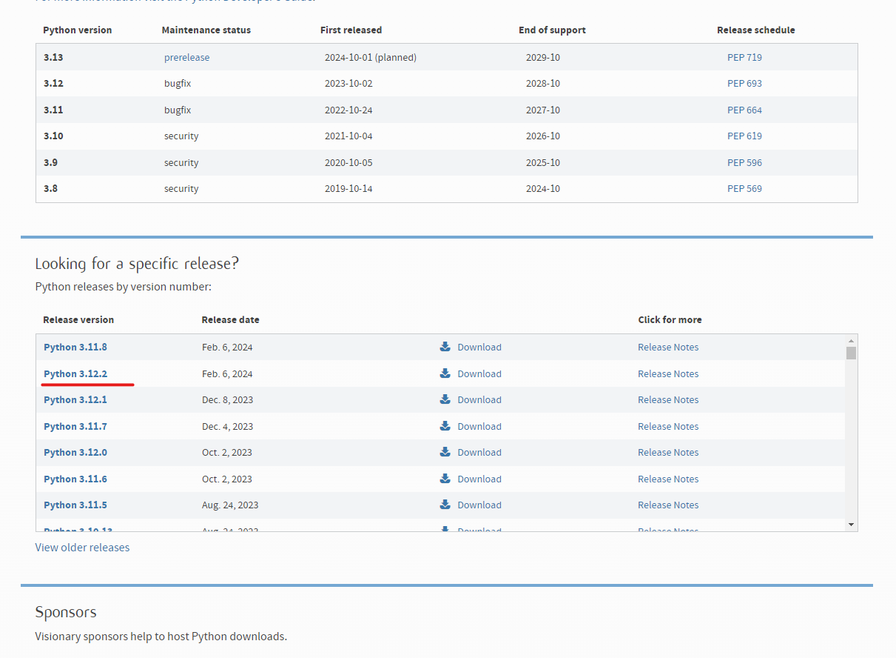
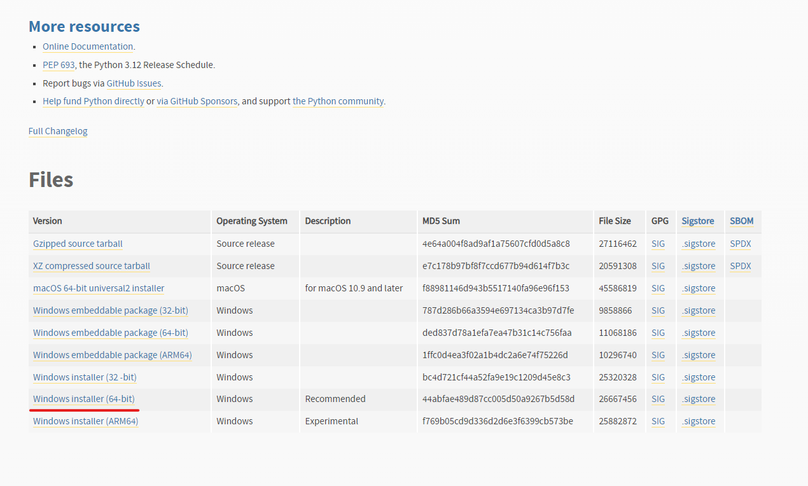
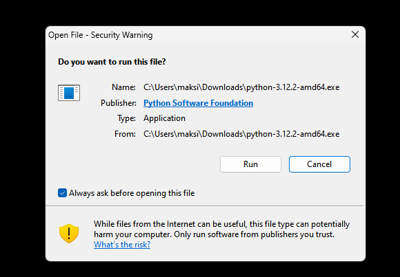
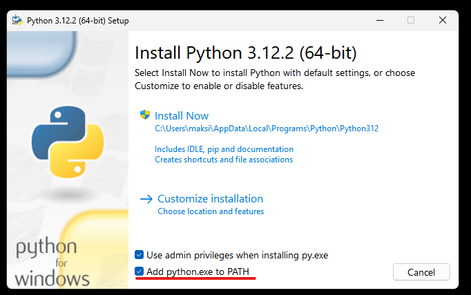

Python compiler installation guide
==================================

`Install Python on Windows`_
`Install Python on Mac`_

Install Python on Windows
-------------------------

1) Go to _site: https://www.python.org/

2) Press "Downloads" button

3) Select the last stable realise

4) Go to files and select Windows build

5) Press "Run" button

6) Select "Add python.exe to PATH" and press the Install button.

Install Python on Mac
---------------------

1) Go to cmd

2) Install with brew. For install Brew use: https://brew.sh/

3) Write command: :code:`brew install python@<<version>>`
   example: :code:`brew install python@3.12`
